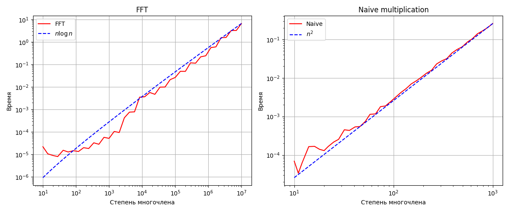

# Быстрое умножение многочленов с помощью FFT

В этом небольшом тексте иллюстрируется алгоритм быстрого умножения многочленов с помощью быстрого преобразования Фурье; этот алгоритм по скорости работы сравнивается с обычным методом перемножения многочленов.

